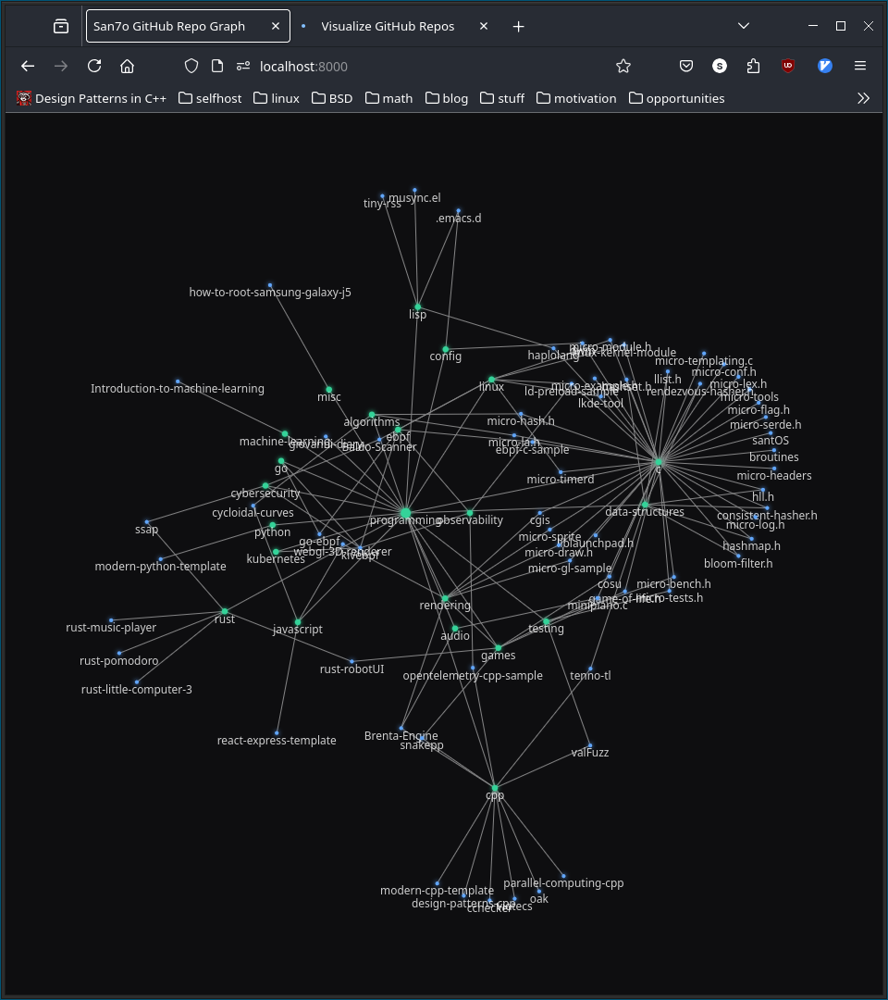

# repo-graph

Visualize GitHub repositories through a graph based on their
topics. You can move the nodes, zoom in and out, and click on them to
open the repo. Data is fetched dynamically when loading the page.

## Motivation

I have a lot of repositories and I needed some kind of mental map to
keep them organized, so here it is.
